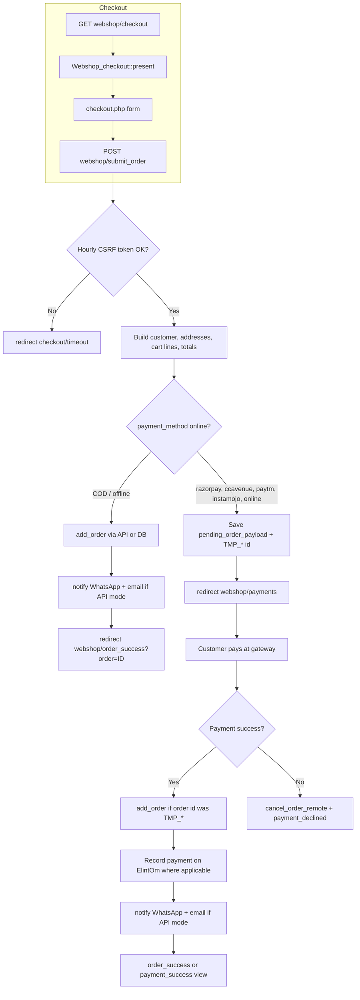

# Order placed successfully — storefront flow, WhatsApp & email

This document describes what happens after a customer completes checkout on the Gulf Pharmacy / API-first storefront: how the order is created, when **WhatsApp** and **email** notifications run, and what the **“Order Placed Successfully!”** page shows.

For the wider ElintOm HTTP bridge, cart, and payment architecture, see [WEBSHOP_API_ARCHITECTURE.md](./WEBSHOP_API_ARCHITECTURE.md).

---

## 1. Quick summary

| Layer | Responsibility |
|-------|----------------|
| **Browser** | Checkout form → `POST webshop/submit_order` (or gateway return URLs) |
| **`Webshop::submit_order()`** | Validates form, builds order + lines, branches on payment type |
| **`Webshop_api_model::add_order()`** | Creates sale in ElintOm (`addorder`) or local DB (hybrid) |
| **Notifications** | **Best-effort** WhatsApp + email **before** redirect to success (COD) or **after** successful online payment |
| **`Webshop::order_success()`** | Loads order for display, **clears cart** — does **not** send WhatsApp/email |
| **ElintOm (POS)** | Actually delivers WhatsApp template and order confirmation email when API actions are called |

The success screen is **informational only**. Customers still receive WhatsApp/email from **ElintOm** (API mode) or **local WhatsApp** (legacy DB mode), depending on configuration.

---

## 2. End-to-end flow (diagram)



---

## 3. Entry points & routes

| URL / action | Controller method | Role |
|--------------|-------------------|------|
| `webshop/checkout` | `Webshop::checkout()` → `Webshop_checkout::present()` | Checkout page (addresses, shipping, payment choice) |
| `webshop/submit_order` | `Webshop::submit_order()` | **Main** order submission (`POST`, hidden `submit_order` = `md5(date('Y-m-d H'))`) |
| `webshop/payments` | `Webshop::payments()` | Online payment chooser / gateway launch |
| `webshop/order_success?order=…` | `Webshop::order_success()` | **“Order Placed Successfully!”** page |
| `webshop/payment_ccavResponseHandler` | CCAvenue return | Success → `payment_success` view (not `order_success`) |
| `webshop/payment_instamojoResponseHandler` | Instamojo return | Success → `order_success` |
| `webshop/paytm_response` (Paytm handler) | Paytm return | Success → `order_success` |
| `webshop/razorpay_verify` | Razorpay return | Success → `order_success` |

Gulf Pharmacy theme view:  
`application/views/plane_vanila_theme/gulfpharmacy_theme/components/order_success.php`

CCAvenue uses a sibling template:  
`components/payment_success.php` (title: “Payment Successful”).

---

## 4. `submit_order()` — order creation branch

**File:** `application/controllers/Webshop.php` — `submit_order()`

### 4.1 Guards

1. POST must include `submit_order`.
2. `submit_order` hidden field must equal `md5(date('Y-m-d H'))` (hourly token). On mismatch → flash “Request Timeout” → `webshop/checkout/timeout`.
3. Terms checkbox required.
4. Logged-in users: order is always bound to **session** `user_id`, not a phone lookup on the form.

### 4.2 Build order payload

From session cart + POST:

- Resolve or create **customer** (`webshop_api_model->add_customer` for guests).
- Resolve **billing/shipping** address ids (`add_address` or saved address).
- For each cart line: load product via `get_product_by_id`, compute tax (CGST/SGST/IGST), build `$products[]` and sale header `$order[]` (`reference_no` like `ES-YYYYMMDD-…`, `sale_status` = `Received`, `payment_status` = `due` until paid online).

### 4.3 Payment method split

```php
$is_online = in_array($payment_method, ['razorpay', 'ccavenue', 'paytm', 'instamojo', 'online'], true);
```

| Branch | What happens |
|--------|----------------|
| **Online** | **No** `add_order` yet. Session stores `pending_order_payload` `{ order, products, customer }`, `pending_payment_order` (amount, ref, currency), and a placeholder id `TMP_` + 8 hex chars. Optional disk cache under `application/cache/pending_orders/`. Redirect: `webshop/payments?order=TMP_…&customer=…`. |
| **COD / other offline** | `webshop_api_model->add_order($order, $products)` immediately → notifications → `webshop/order_success?order={id}&customer={id}`. |

---

## 5. Notifications (WhatsApp & email)

Notifications are triggered from the **controller** after a **real numeric** `order_id` exists. Failures are caught, logged, and **do not** block the redirect to the success page.

### 5.1 API / DB-less mode (`uses_elintom_api_for_orders()`)

True when `Webshop_api_model` is in API mode **or** there is no local POS database.

| Step | PHP | ElintOm HTTP `action` |
|------|-----|------------------------|
| WhatsApp | `notify_order_placed_whatsapp_remote($order_id, 'true')` | `notifywebshoporderwhatsapp` — params: `order_id`, `flag` |
| Email | `notify_order_placed_email_remote($order_id)` | `notifywebshoporderemail` — param: `order_id` |

**Client:** `Elintom_api_client::notify_webshop_order_whatsapp()` / `notify_webshop_order_email()`  
**Model:** `Webshop_api_model` (lines ~2483–2518)

ElintOm is responsible for:

- Loading the sale from the POS database
- Using configured `whatsapp_api_key` / mail settings
- Sending the template / message to the customer’s phone and email on the order

The storefront does **not** render or attach PDF invoices in this path.

### 5.2 Legacy hybrid mode (local MySQL)

When `uses_elintom_api_for_orders()` is **false** and `$this->db` is available:

| Channel | Behavior on `submit_order` |
|---------|----------------------------|
| **WhatsApp** | Loads billing address phone → `getcountryCode()` → `call_whatsapp_cheerio()` → `Whatsapp_model::send_order_whatsapp_message()` |
| **Email** | **Not** sent from `submit_order` in this branch |

### 5.3 When notifications fire

| Scenario | WhatsApp | Email (API mode) |
|----------|----------|------------------|
| COD / offline right after `submit_order` | Yes (API or legacy) | Yes (API only) |
| CCAvenue success (`payment_ccavResponseHandler`) | After `add_order` + `record_ccavenue_payment_remote` | Yes |
| Instamojo success | After `instomojoEshopAfterSale` | Yes |
| Paytm `TXN_SUCCESS` | After `PaytmAfterSale` | Yes |
| Razorpay signature verified | After `RazorPayAfterSale` | Yes |
| `order_success()` page load | **No** | **No** |

### 5.4 Other email helpers (not order confirmation)

These use CodeIgniter’s `email` library and **`_send_basic_email()`** (`Settings->default_email` as From). They are **separate** from ElintOm order confirmation:

| Method | When |
|--------|------|
| `send_welcome_mail()` | New guest customer created during checkout |
| `send_registration_email()` | Registration flow |
| `send_invoice_by_email()` | Simple plaintext/HTML invoice stub — **not** called from `submit_order` in current code |

---

## 6. Online payments → deferred `TMP_` orders

Until payment succeeds, the sale may **not** exist in ElintOm.

| Storage | Contents |
|---------|----------|
| `session.pending_order_payload` | Full `order`, `products`, `customer` arrays |
| `session.pending_payment_order` | `grand_total`, `reference_no`, `currency_iso`, `method` |
| `session.order_id` | `TMP_xxxxxxxx` or final id |
| Disk cache | Backup if session is lost between gateway redirect (`_pending_order_payload_cache_*`) |

On gateway **success**:

1. If `order_id` starts with `TMP_`, call `add_order()` with cached payload → replace with real numeric `sale_id`.
2. Record payment (e.g. `record_ccavenue_payment_remote` for CCAvenue).
3. Call WhatsApp + email notify (API mode).
4. Clear cart session keys.
5. Redirect to success UI.

On **decline**: `cancel_order_remote()`; cart may be kept for retry (see architecture doc).

### 6.1 Gateway-specific success pages

| Gateway | Success UI |
|---------|------------|
| CCAvenue | `payment_success` component (shows gateway tracking/bank ref when present) |
| Razorpay, Paytm, Instamojo | `order_success` (`Order Placed Successfully!`) |
| COD selected on `payments` POST | Redirects to `order_success` with existing `order` query param (order should already exist if checkout used offline payment on first submit) |

---

## 7. `order_success()` — what the customer sees

**File:** `Webshop::order_success()`  
**View:** `components/order_success.php`

### 7.1 Data loading

```php
$this->data['order'] = $this->webshop_model->get_order_by_id($order_id);
$this->data['items'] = $this->webshop_model->get_order_items_by_order_id($order_id);
```

With API model aliased as `webshop_model`, `get_order_by_id()` calls ElintOm `getorder` (by numeric id or `ES-…` reference). If the API returns nothing, a **minimal stub** is used so the page still renders:

- `id`, `reference_no` (`ES-{id}`), `grand_total` = 0

### 7.2 Session cleanup (always on this page)

- `unset($_SESSION['cart'])`
- `unset_userdata`: `order_id`, `pending_payment_order`, `checkout_currency_iso`, `pending_order_payload`

### 7.3 UI content

- Title: **Order Placed Successfully!**
- Order reference, line items (name, qty, line price), grand total if items exist
- Actions: Continue Shopping, My Orders (`webshop/your_orders`)
- Restaurant theme: redirects to `webshop?order_status=success` instead of this template

### 7.4 Performance note

`order_success` is listed in `webshop_lightweight_bootstrap` (with `cart`, payment error pages) to skip heavy home-page section loading.

---

## 8. Sequence: COD (API mode)

```
Customer → POST submit_order (payment_method=cod)
    → add_order → ElintOm returns sale_id
    → POST notifywebshoporderwhatsapp
    → POST notifywebshoporderemail
    → HTTP 302 → /webshop/order_success?order={sale_id}
    → getorder (display)
    → clear cart session
```

WhatsApp/email may still be processing on ElintOm after the browser already shows the success page.

---

## 9. Sequence: CCAvenue (API mode)

```
Customer → submit_order (ccavenue) → TMP_* + pending payload → payments
    → CCAvenue → payment_ccavResponseHandler
    → decrypt response; if Success:
         → add_order if TMP_*
         → recordccavenuepayment
         → notify WhatsApp + email
         → payment_success view (cart cleared)
```

---

## 10. Configuration & operations checklist

| Concern | Where to verify |
|---------|-----------------|
| API mode enabled | App config / `Webshop_api_model::$api_mode`, no local DB |
| ElintOm reachable | `Elintom_api_client` base URL + API key |
| WhatsApp template | ElintOm POS: WhatsApp API key + template for webshop orders |
| Order email content | ElintOm handler for `notifywebshoporderemail` |
| SMTP for welcome/registration only | CodeIgniter `email` config + `Settings->default_email` |
| Gateway credentials | `getgatewaycredentials` API or `application/config/payment_gateways.php` |
| Failed notify | `application/logs/` — search `WhatsApp notify failed`, `Email notify failed`, `notify_order_placed_*` |

---

## 11. Code reference map

| Concern | Location |
|---------|----------|
| Submit + notify (COD) | `Webshop.php` ~2951–3487 |
| Order success page | `Webshop.php` ~4530–4563 |
| API add order + notify wrappers | `Webshop_api_model.php` ~2451–2524 |
| HTTP actions | `Elintom_api_client.php` ~332–385 |
| Success view | `views/.../components/order_success.php` |
| Payment success view | `views/.../components/payment_success.php` |
| CCAvenue notify | `Webshop.php` ~3956–4022 |
| Instamojo / Paytm / Razorpay notify | `Webshop.php` ~6837–7304 |
| Legacy WhatsApp | `Webshop.php` `call_whatsapp_cheerio()` ~7720 |
| Local email helper | `Webshop.php` `_send_basic_email()` ~5310 |

---

## 12. Common misconceptions

1. **The success page does not send email.** Confirmation is fired earlier (or on gateway callback), via ElintOm API or legacy WhatsApp.
2. **Online orders may not notify until payment succeeds** — no `order_id` in ElintOm until `add_order` after `TMP_` resolution.
3. **`send_invoice_by_email()` is not part of the main checkout path** — order email in API mode is entirely on ElintOm’s `notifywebshoporderemail`.
4. **Notification errors are silent to the user** — check server logs if customers report missing WhatsApp/email.

---

*Last aligned with codebase: Gulf Pharmacy / `plane_vanila_theme` + `Webshop_api_model` API-first order path.*
