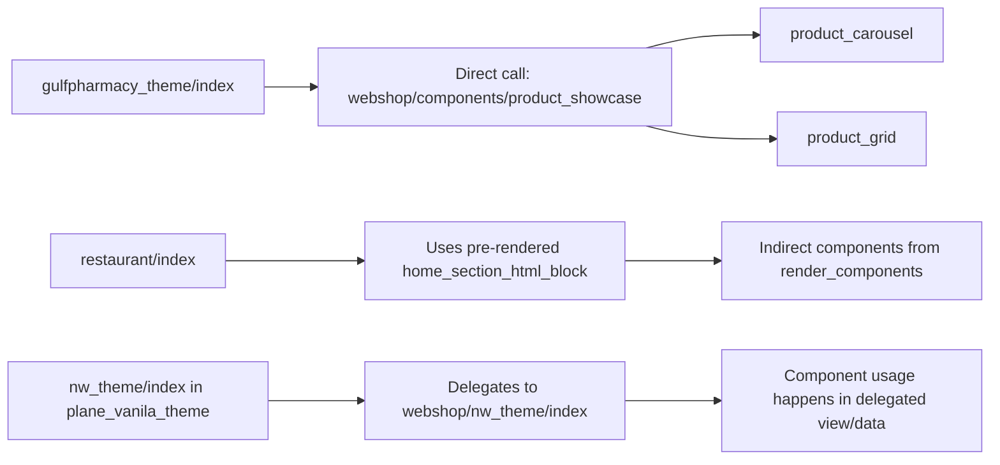
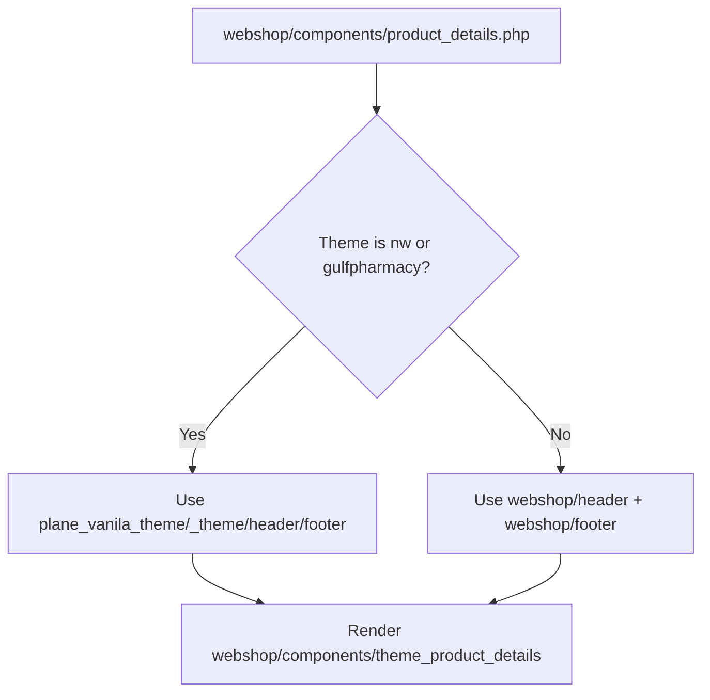

# Theme Component Flow Diagram

This is a visual reference for how storefront requests are resolved and how `webshop/components` are used from `plane_vanila_theme`.

## 1) Runtime view resolution

```mermaid
flowchart TD
    A[Request to Webshop controller] --> B[Webshop::load_view(method, data)]
    B --> C[resolve_webshop_view_path(method)]
    C --> D{Allowed in plane_vanila_theme<br/>and file exists?}
    D -- Yes --> E[Render plane_vanila_theme/method.php]
    D -- No --> F[Render webshop/method.php]
```

## 2) Dynamic CMS section rendering path

```mermaid
flowchart TD
    A[CMS page/home sections] --> B[Webshop_section_engine::render_components]
    B --> C[normalize section_type]
    C --> D[resolve_component_view(type)]
    D --> E{Mapped type?}
    E -- Yes --> F[Render webshop/components/*.php]
    E -- No --> G[Skip section]
    F --> H[Compose HTML block]
    H --> I[home_section_html_block / cms_body_html]
    I --> J[Theme view prints composed HTML]
```

## 3) Theme-specific component usage



## 4) Section type -> component map

- `html_block` -> `webshop/components/html_block`
- `product_grid` -> `webshop/components/product_grid`
- `product_carousel` -> `webshop/components/product_carousel`
- `category_grid` -> `webshop/components/category_grid`
- `category_carousel` -> `webshop/components/category_carousel`
- `banner` -> `webshop/components/banner`
- `hero_banner` -> `webshop/components/banner`

## 5) Product details shell flow



