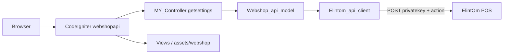
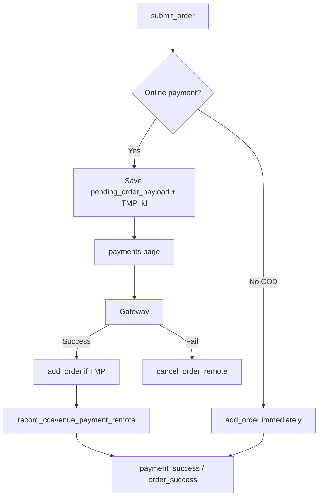

# Webshop API — Architecture & Logic Reference

**Project:** `webshopapi` (CodeIgniter 3 storefront — “Webshop AI”)  
**Backend:** ElintOm POS over HTTP (default: no local MySQL)  
**Last updated:** 2026-05-15

This document explains how the storefront works end-to-end: bootstrap, HTTP bridge, models, controllers, session, checkout, payments, themes, and configuration. Tables are used throughout for quick lookup.

---

## Table of contents

1. [System overview](#1-system-overview)
2. [Directory layout](#2-directory-layout)
3. [Request lifecycle](#3-request-lifecycle)
4. [Configuration](#4-configuration)
5. [HTTP bridge (ElintOm API)](#5-http-bridge-elintom-api)
6. [ElintOm actions reference](#6-elintom-actions-reference)
7. [Core classes & responsibilities](#7-core-classes--responsibilities)
8. [Session state](#8-session-state)
9. [Catalogue flows](#9-catalogue-flows)
10. [Cart & AJAX](#10-cart--ajax)
11. [Checkout & submit order](#11-checkout--submit-order)
12. [Tax & pricing](#12-tax--pricing)
13. [Payments](#13-payments)
14. [Authentication](#14-authentication)
15. [Views & themes](#15-views--themes)
16. [Caching](#16-caching)
17. [API vs database modes](#17-api-vs-database-modes)
18. [Failure modes & debugging](#18-failure-modes--debugging)
19. [Key source files](#19-key-source-files)

---

## 1. System overview

| Concept | Description |
|--------|-------------|
| **Role of this app** | Customer-facing e-commerce UI: browse, cart, checkout, account, payments |
| **Role of ElintOm** | System of record: products, stock, customers, sales, settings, CMS |
| **Default data path** | Storefront → `Webshop_api_model` → `Elintom_api_client` → POST ElintOm |
| **Entry point** | `index.php` (CodeIgniter front controller) |
| **Default route** | `webshop` → `Webshop` controller |
| **Primary API URL** | `{elintom_api_base_url}webshop_api/index` |
| **Legacy API URL** | `{elintom_api_base_url}api3/eshop` (catalogue fallback only) |

### Architecture diagram



---

## 2. Directory layout

| Path | Purpose |
|------|---------|
| `index.php` | Application bootstrap |
| `system/` | CodeIgniter 3 core |
| `application/config/` | Routes, `elintom_api.php`, autoload, payment gateways |
| `application/controllers/Webshop.php` | Main storefront (cart, checkout, CMS, payments) |
| `application/controllers/Webshop_settings.php` | Admin/theme settings (when DB/tools available) |
| `application/core/MY_Controller.php` | Loads settings from API on every request |
| `application/models/Webshop_api_model.php` | Single adapter for API-mode data |
| `application/models/Webshop_model.php` | Legacy MySQL model (hybrid installs) |
| `application/libraries/Elintom_api_client.php` | HTTP client to ElintOm |
| `application/libraries/Elintom_api_response.php` | JSON normalization |
| `application/libraries/Webshop_action_engine.php` | Cart & wishlist mutations |
| `application/libraries/Webshop_checkout.php` | Checkout GET presentation |
| `application/views/plane_vanila_theme/` | Modern themes (e.g. Gulf Pharmacy) |
| `application/views/webshop/` | Legacy theme views |
| `assets/webshop/` | Static CSS/JS/images for themes |
| `application/docs/` | Contracts and this document |

---

## 3. Request lifecycle

| Step | Component | What happens |
|------|-----------|--------------|
| 1 | `index.php` | Boots CodeIgniter |
| 2 | `MY_Controller::__construct` | Calls `webshop_api_model->get_settings()` |
| 3 | On SUCCESS | Sets `$Settings`, `$webshop_settings`, `$pos_settings`, media base, normalizes fields |
| 4 | On FAILURE | Renders “API Connection Error” and **stops** (no degraded shop) |
| 5 | `Webshop::__construct` | Aliases `webshop_model` → `webshop_api_model`; loads categories/cart unless lightweight route |
| 6 | Controller method | Business logic + `load_view()` |
| 7 | `load_view()` | Resolves theme path, SEO, optional dynamic sections, outputs HTML |

### Lightweight bootstrap routes

These skip heavy API prep (categories, CMS nav, cart enrichment) for faster pages:

| URI segment (method) | Reason |
|----------------------|--------|
| `order_success` | Post-order confirmation |
| `payment_declined` | Gateway failure |
| `payment_cancel` | User cancelled payment |
| `service_off` | Shop disabled page |

---

## 4. Configuration

### Main config file: `application/config/elintom_api.php`

| Config key | Typical value | Purpose |
|------------|---------------|---------|
| `elintom_api_base_url` | `http://localhost/ElintOm/` | ElintOm root URL (trailing slash added) |
| `elintom_api_private_key` | (secret) | Must match ElintOm API settings |
| `elintom_api_webshop_endpoint_path` | `webshop_api/index` | Primary endpoint path |
| `elintom_api_legacy_endpoint_path` | `api3/eshop` | Legacy catalogue endpoint |
| `elintom_media_uploads_base_url` | empty or full URL | CDN / fixed image host override |
| `elintom_customer_assets_folder` | `default` | Tenant folder when host segment off |
| `elintom_mdata_include_http_host_segment` | `true` | Images under `mdata/{hostname}/uploads/` |
| `elintom_media_use_http_host` | `true` | Build media URL from browser host |
| `elintom_catalog_source` | `api` | `api` or `database` |
| `elintom_catalog_fallback_database` | `false` | Fall back to MySQL if API fails |
| `elintom_http_cache_settings_seconds` | `45` | Session cache for getsettings |
| `elintom_http_cache_categories_seconds` | `0` | Session cache for categories (0 = fresh) |
| `elintom_http_cache_cart_products_seconds` | `60` | Session cache for cart enrichment |
| `elintom_domain_theme_map` | `array()` | Hostname → theme overrides |

### Optional overrides

| File / source | Purpose |
|---------------|---------|
| `elintom_api_switch.php` | Switch base URL/key per environment |
| `elintom_api.local.php` | Machine-local overrides (not in git) |
| Environment variables | `ELINTOM_API_BASE_URL`, `ELINTOM_API_PRIVATE_KEY`, etc. |
| `payment_gateways.php` | Fallback gateway credentials |
| `webshop_shipping.php` | Flat shipping when API omits fees |

### Autoload (`application/config/autoload.php`)

| Autoloaded | Not autoloaded (by default) |
|------------|----------------------------|
| `session` | `database` |
| `elintom_api_client` | |
| Helpers: `url`, `form`, `html`, `webshop`, `elintom_mdata` | |

---

## 5. HTTP bridge (ElintOm API)

### Transport

| Field | Value |
|-------|--------|
| Method | `POST` |
| Content-Type | `application/x-www-form-urlencoded` |
| Required fields | `privatekey`, `action` |
| Tenant context | `http_host` (and related fields from client) |
| Timeout | 90 seconds |
| Success indicator | Root `status`: `"SUCCESS"` (case-insensitive) |

### Endpoints

| Endpoint | Path (default) | Used for |
|----------|----------------|----------|
| Primary | `webshop_api/index` | Settings, catalogue, orders, customers, geo, CMS |
| Legacy | `api3/eshop` | Catalogue fallbacks; some old getsettings shapes |

### Client classes

| Class | File | Role |
|-------|------|------|
| `Elintom_api_client` | `application/libraries/Elintom_api_client.php` | Sends HTTP requests; exposes typed methods per action |
| `Elintom_api_response` | `application/libraries/Elintom_api_response.php` | Parses inconsistent JSON into stable PHP structures |
| `Webshop_api_model` | `application/models/Webshop_api_model.php` | Storefront-facing API; caching; DB fallback |

---

## 6. ElintOm actions reference

### Settings & CMS

| Client method | POST `action` | Typical success payload |
|---------------|---------------|-------------------------|
| `get_settings()` | `getsettings` | `pos_settings`, `webshop_settings`, `website_setting`, `website_setting_sections` |
| `get_next_reference()` | `getnextref` | `reference` |
| `get_cms_page($url)` | `getcmspage` | Page content object |
| `get_cms_pages()` | `getcmspages` | `pages` array |

### Catalogue (primary)

| Client method | POST `action` | Notes |
|---------------|---------------|-------|
| `get_categories()` | `getcategories` | Tree built by `Elintom_api_response` |
| `get_sliders()` | `getsliders` | Home banners |
| `get_products_list(...)` | `getproductslist` | Params: `by`, `byid`, `use_hash`, `limit`, `page` |
| `get_product_by_hash($hash)` | `getproductbyhash` | Product detail |
| `get_entity_tags(...)` | `getentitytags` | Badges / tags |
| `search_products(...)` | `searchproducts` | Keyword + optional category |

### Catalogue (legacy `api3/eshop`)

| Client method | POST `action` | When used |
|---------------|---------------|-----------|
| `get_parent_categories` | `getparentcategories` | Fallback |
| `get_all_categories` | `getallcategories` | Fallback when primary categories empty |
| `get_subcategories` | `getsubcategories` | Fallback |
| `get_all_products` | `getallproducts` | Category grid fallback |
| `get_product_stocks` | `getproductstocks` | Stock lists |

### Geography

| Client method | POST `action` | Notes |
|---------------|---------------|-------|
| `get_states()` | `getstates` / `get_states` | Retries snake_case on error `103` |
| `get_countries()` | `getcountries` / `get_countries` | Same |

### Customer & authentication

| Client method | POST `action` | Purpose |
|---------------|---------------|---------|
| `get_customer($filter)` | `getcustomer` | By id, phone, email |
| `create_customer($data)` | `createcustomer` | Guest checkout registration |
| `login_customer` | `logincheck` | Login |
| `register_check` | `registercheck` | Duplicate phone/email |
| `send_password_otp` | `passwordotpsend` | OTP delivery via ElintOm |
| `reset_customer_password` | `customerresetpassword` | After OTP verified in storefront |

### Addresses

| Client method | POST `action` |
|---------------|---------------|
| `get_addresses` | `getaddresses` |
| `add_address` | `addaddress` |
| `update_address` | `updateaddress` |
| `delete_address` | `deleteaddress` |
| `set_address_default` | `setaddressdefault` |

### Orders & payments

| Client method | POST `action` | Payload notes |
|---------------|---------------|---------------|
| `add_order` | `addorder` | `order` and `items` as **JSON-encoded strings** |
| `get_order` | `getorder` | `order_id` and/or `reference_no` (e.g. `ES-20260515-ABC123`) |
| `record_ccavenue_payment` | `recordccavenuepayment` | `response_json` |
| `cancel_order` | `cancelorder` | On payment decline / cancel |
| `get_gateway_credentials` | `getgatewaycredentials` | Enabled gateways + keys |
| `get_customer_sales` | `getcustomersales` | Order history |
| `apply_coupon` | `applycoupon` | Code + cart total |
| `notify_webshop_order_whatsapp` | `notifywebshoporderwhatsapp` | Post-order WhatsApp |
| `notify_webshop_order_email` | `notifywebshoporderemail` | Post-order email |

### Wishlist & reviews

| Client method | POST `action` |
|---------------|---------------|
| `get_wishlist` | `getwishlist` |
| `add_wishlist` | `addwishlist` |
| `remove_wishlist` | `removewishlist` |
| `add_product_review` | (product review action) |
| `get_product_reviews` | (reviews list) |
| `get_product_rating` | (rating aggregate) |
| `get_company` | `getcompany` | Biller / company for checkout |

---

## 7. Core classes & responsibilities

| Class | Layer | Responsibility |
|-------|-------|----------------|
| `MY_Controller` | Core | API settings bootstrap; `$Settings`, media base, theme override |
| `Webshop` | Controller | All storefront routes; `submit_order`; payments; `_remap` for CMS slugs |
| `Webshop_settings` | Controller | Theme/admin configuration |
| `Webshop_api_model` | Model | All ElintOm calls; session caches; order/customer/catalogue |
| `Webshop_model` | Model | Direct MySQL (legacy / hybrid) |
| `Elintom_api_client` | Library | Raw HTTP + action names |
| `Elintom_api_response` | Library | Normalize categories, products, geo, product detail |
| `Webshop_action_engine` | Library | `add_to_cart`, stock checks, wishlist; **re-prices from API** |
| `Webshop_checkout` | Library | Checkout GET: geo, addresses, shipping, stock validation |
| `Webshop_render_engine` | Library | Optional dynamic CMS section injection |
| `Webshop_theme_engine` | Library | Active theme resolution |
| `Webshop_section_engine` | Library | Section summaries for dynamic pages |
| `Webshop_meta_engine` | Library | Meta HTML from tags |

### Controller alias pattern

In `Webshop::__construct`:

```php
$this->webshop_model = $this->webshop_api_model;
```

Controllers always call `$this->webshop_model`; implementation is API or DB depending on config.

---

## 8. Session state

| Key | Type | Purpose |
|-----|------|---------|
| `$_SESSION['cart']` | array | Cart lines keyed by `product_id` or `product_id_variantId` |
| `$_SESSION['cart_coupon']` | array | `code`, `discount` after apply coupon |
| `session->webshop` | object | Logged-in user: `user_id`, `is_login`, name, email, phone |
| `customer_register` | array | Registration/checkout helper |
| `order_id` | scalar | Last order id or `TMP_xxxxxxxx` pending payment |
| `pending_order_payload` | array | `{ order, products, customer }` for deferred online payment |
| `pending_payment_order` | array | `grand_total`, `reference_no`, `currency_iso`, `method` |
| `checkout_currency_iso` | string | Currency at checkout |
| `postdata` | array | Repopulate form after submit timeout |
| `elintom_cache_getsettings` | array | TTL + JSON blob |
| `elintom_cache_categories` | array | TTL + serialized tree |
| `elintom_cache_cart_data` | array | TTL + serialized cart enrichment |

### Cart line fields (per item)

| Field | Description |
|-------|-------------|
| `product_id` | Product primary key |
| `variant_id` | Option/variant id (0 if none) |
| `quantity` | Line quantity |
| `product_price` | Unit price from API (authoritative) |
| `price` | Selling price used in totals |
| `tax_rate` | Tax percentage |
| `tax_method` | `0` inclusive, `1` exclusive |
| `promotion_price` | Promo if applicable |
| `variant_price` | Variant add-on |
| `unit_quantity` | Pack/multiplier |

**Important:** Cart exists only in PHP session until `submit_order` or post-payment `add_order` for online gateways.

---

## 9. Catalogue flows

### Home page

| Step | Method / API | Description |
|------|--------------|-------------|
| 1 | `home_page_data()` | Tries CMS URLs `/`, `/home-page`, `/home` via `getcmspage` |
| 2 | Theme sections | `get_theme_sections` / CMS blocks |
| 3 | Categories / products | Grids from `get_categories`, `get_products_list` |
| 4 | View | `load_view` → plane_vanila or legacy theme |

### Category products

| Step | Description |
|------|-------------|
| URL | Often MD5(category id) for SEO |
| Resolve id | `_resolve_category_id_from_md5()` walks category tree |
| Active check | `checkIsCategoryActiveForWebshop()` — `in_eshop`, `is_active` |
| List | `get_products_list('category', $id, $hash, $limit, $page)` |
| Fallback | Legacy `getallproducts` if primary API empty |

### Product detail

| Step | API / method |
|------|----------------|
| Load product | `get_product_by_hash` |
| Normalize | `normalize_product_detail_item_for_view` |
| Ratings | `get_product_rating` |
| Tags | `get_entity_tags` |

### Search

| Route | Backend |
|-------|---------|
| `search_products` | `searchproducts` |
| `search_suggest` | Lighter JSON for autocomplete |

### Category tree cache

| Cache | TTL config | Invalidation |
|-------|------------|--------------|
| In-request `$_categories_cache` | Per HTTP request | Automatic |
| Session `elintom_cache_categories` | `elintom_http_cache_categories_seconds` | Version field in payload; TTL expiry |

---

## 10. Cart & AJAX

### Endpoint

| URL | Method | Body |
|-----|--------|------|
| `webshop/webshop_request` | POST | `action` + action-specific fields |

### `webshop_request` actions

| `action` value | Handler | Backend |
|----------------|---------|---------|
| `add_to_cart` | `add_to_cart` | `Webshop_action_engine` |
| `buy_now` | `buy_now` | Clear cart, add one line |
| `update_cart` | `update_cart` | Quantity + stock check |
| `add_to_wishlist` | `add_to_wishlist` | API; requires login |
| `remove_from_wishlist` | `remove_from_wishlist` | API |
| `load_header_cart` | `load_header_cart_items` | Mini cart |
| `remove_cart_item` | `remove_cart_item` | Session |
| `mini_cart` | `mini_cart` | Drawer UI |
| `mini_cart_remove` | `mini_cart_remove` | Session |
| `apply_coupon` | `apply_coupon` | `applycoupon` on ElintOm |
| `manage_address` | `manage_address` | Address CRUD API |
| `account_panel_data` | `account_panel_data` | Lazy My Account tabs |
| `get_section` | `get_sections` | Home CMS sections |
| `get_product_images` | `set_product_gallery` | Gallery JSON |

### Cart enrichment: `get_cart_data()`

| Step | Description |
|------|-------------|
| 1 | Collect product ids from `$_SESSION['cart']` |
| 2 | Bulk fetch via `get_products_list('products', $ids)` |
| 3 | Fill gaps via `get_product_by_hash(md5(id))` per missing id |
| 4 | Return `['products' => [ id => normalized row ]]` for cart/checkout views |
| 5 | Optional session cache keyed by cart signature |

### Security: pricing

| Rule | Implementation |
|------|----------------|
| Never trust client price on add-to-cart | `Webshop_action_engine::resolve_product_pricing()` |
| Re-validate stock | `validate_session_cart_stock()` before checkout |
| Re-fetch at submit | `get_product_by_id` per line in `submit_order` |

---

## 11. Checkout & submit order

### GET `checkout` (`Webshop_checkout::present`)

| Step | Action |
|------|--------|
| 1 | Redirect if no cart |
| 2 | `validate_session_cart_stock()` |
| 3 | Load states, countries from API |
| 4 | If logged in: load `get_customer_address` |
| 5 | Resolve shipping from settings or `webshop_shipping.php` |
| 6 | Refresh `get_cart_data()` |
| 7 | `load_view('checkout')` |

### POST `submit_order` — gates

| Gate | Check | On failure |
|------|-------|------------|
| 1 | `submit_order` token = `md5(date('Y-m-d H'))` | Redirect `checkout/timeout` |
| 2 | Terms accepted | Flash error → checkout |
| 3 | Customer resolution | Logged-in → session `user_id` only |
| 4 | Address ownership | Posted address ids must belong to customer |
| 5 | Each line product exists via API | Redirect cart |
| 6 | Server-side `grand_total` | Never trust client total |

### Customer resolution rules

| Scenario | Behavior |
|----------|----------|
| Logged in + saved address | Force `customer_id` = session user |
| Logged in + new address | Create address via API; still session user |
| Guest + billing form | Find by phone or `create_customer` |
| Guest lookup by phone | **Not** used when session user exists |

### Order header (sale) fields (summary)

| Field | Typical value |
|-------|----------------|
| `reference_no` | `ES-YYYYMMDD-` + uniqid (API mode) |
| `eshop_sale` | `1` |
| `sale_status` | `Received` |
| `payment_status` | `due` (until paid online) |
| `payment_method` | From form: cod, ccavenue, razorpay, etc. |
| `warehouse_id`, `biller_id` | From `webshop_settings` |
| Tax totals | `cgst`, `sgst`, `igst` from line math |
| Addresses | `billing_address_id`, `shipping_address_id` |

### Payment branch after order built

| `payment_method` | Next step |
|------------------|-----------|
| `razorpay`, `ccavenue`, `paytm`, `instamojo`, `online` | **Defer** `add_order`; store `pending_order_payload`; `TMP_*` id; redirect `payments` |
| COD / other offline | `add_order` immediately → notify → `order_success` |

---

## 12. Tax & pricing

### Helper: `product_sale_price_webshop()` (`webshop_helper.php`)

| Input | Effect |
|-------|--------|
| Promotion dates | Sets `promo_price` if within window |
| Variant price array | Adds to base price |
| Coupon per line | Usually **not** applied at line level on submit (order-level coupon only) |

### Tax methods

| `tax_method` | Name | `net_unit_price` | `unit_tax` | `unit_price` (customer pays) |
|--------------|------|------------------|------------|------------------------------|
| `1` | Exclusive | Catalogue price (no tax in price) | `price * rate / 100` | `price + unit_tax` |
| `0` | Inclusive | `price - extracted tax` | `price * rate / (100 + rate)` | Catalogue price (tax included) |

### Grand total at submit

| Component | Formula |
|-----------|---------|
| Line net | Sum of `net_unit_price * quantity` |
| Line tax | Sum of `unit_tax * quantity` |
| Shipping | From form (validated numeric) |
| Coupon | Order-level discount subtracted once |
| **Grand total** | `(total + total_tax + shipping) - coupon` |

### Interstate GST (India)

| Condition | Line split |
|-----------|------------|
| Customer `state_code` ≠ biller `state_code` | IGST on line |
| Same state | CGST + SGST (half each of item tax) |

---

## 13. Payments

### Flow overview



### `payments` controller

| Phase | Behavior |
|-------|----------|
| GET | Load order stub; use `pending_payment_order.grand_total` if API row missing/zero |
| GET | `get_gateway_credentials` from API or `payment_gateways.php` |
| POST | Switch on gateway: ccavenue, razorpay, paytm, instamojo, cod |

### Deferred order (`TMP_` prefix)

| Storage | Purpose |
|---------|---------|
| `session.pending_order_payload` | Order + lines + customer |
| `session.pending_payment_order` | Amount, ref, currency for payment UI |
| Disk cache `application/cache/pending_orders/` | Survive session loss between gateway redirect |

| Event | Action |
|-------|--------|
| CCAvenue Success + `TMP_*` | `add_order` then `record_ccavenue_payment_remote` |
| Success | Clear cart; WhatsApp/email notify |
| Decline | `cancel_order_remote`; **keep cart** for retry |

### Supported gateways (storefront)

| Gateway | Handler notes |
|---------|----------------|
| CCAvenue | Encrypt request; decrypt response; primary deferred-order path |
| Razorpay | `razorpay_init`; deferred order support |
| Paytm | `paytm_init` |
| Instamojo | Redirect to `longurl` |
| COD | Redirect `order_success` without gateway |
| Stripe | Not configured — safe error message |

---

## 14. Authentication

### Login (`webshop/login`)

| Step | Detail |
|------|--------|
| POST detection | Any POST (supports `identity`+`password` or legacy `phone`+`webshop_password`) |
| API | `authenticate_user_password` → `logincheck` |
| Success | `session.webshop` with `is_login`, `user_id` |
| Cart present | Redirect to checkout |
| Failure | PRG + `toast_error` flash |

### Register

| Step | API |
|------|-----|
| Duplicate check | `registercheck` |
| Create | `createcustomer` |
| Welcome email | Storefront `_send_basic_email` (optional) |

### Forgot password

| Step | Where |
|------|--------|
| OTP generated | Storefront session (TTL) |
| OTP sent | ElintOm `passwordotpsend` |
| Password reset | `customerresetpassword` after OTP verified locally |

### Logout

| Cleared |
|---------|
| `$_SESSION['cart']`, `$_SESSION['webshop']` |

---

## 15. Views & themes

### `load_view()` pipeline

| Order | Step |
|-------|------|
| 1 | `resolve_dynamic_runtime_data()` (optional) |
| 2 | Logo LCP hints |
| 3 | SEO from `theme_page_seo.json`; inactive → 404 |
| 4 | `resolve_webshop_view_path($method)` |
| 5 | Render view to string |
| 6 | Inject preload + meta tags |
| 7 | Output HTML |

### View resolution priority

| Priority | Path pattern |
|----------|----------------|
| 1 | `plane_vanila_theme/{theme}_theme/pages/{page}` |
| 2 | `plane_vanila_theme/{theme}_theme/components/{component}` |
| 3 | `plane_vanila_theme/gulfpharmacy_theme/components/{component}` (shared fallback) |
| 4 | `webshop/{theme}_theme/{method}` |
| 5 | `webshop/{method}.php` |

### Theme folder map

| `webshop_theme` setting | View folder |
|-------------------------|-------------|
| `gulfpharmacy` | `gulfpharmacy_theme` |
| `nw` | `nw_theme` |
| `restaurant` | `webshop_restaurant_t1` |

### Gulf Pharmacy checkout files

| File | Role |
|------|------|
| `components/checkout.php` | Checkout page shell |
| `components/checkout_form.php` | Billing/shipping/payment form fields → POST to `submit_order` |

### URL routing (`_remap`)

| Request | Resolution |
|---------|------------|
| Existing method on `Webshop` | Call method |
| Unknown slug | Try theme page file |
| Unknown slug | Try CMS `get_cms_page_by_url('/{slug}')` |
| Else | 404 |

---

## 16. Caching

| Cache | Location | Config key | Default TTL |
|-------|----------|------------|-------------|
| Settings | Session `elintom_cache_getsettings` | `elintom_http_cache_settings_seconds` | 45s |
| Categories | Session `elintom_cache_categories` | `elintom_http_cache_categories_seconds` | 0 (off) |
| Cart products | Session `elintom_cache_cart_data` | `elintom_http_cache_cart_products_seconds` | 60s |
| Categories (request) | `Webshop_api_model::$_categories_cache` | Per request | — |
| Home CMS | `$_home_page_data_memo` | Per request | — |
| Order fetch | `$_order_cache` | Per request | — |
| Gateway creds | `$_gateway_credentials_cache` | Per request | — |

---

## 17. API vs database modes

| Mode | Config | Database autoload | Catalogue source | Orders |
|------|--------|-------------------|------------------|--------|
| **API-only (default)** | `catalog_source=api`, no DB | No | ElintOm HTTP | `addorder` API |
| **Hybrid** | DB + `catalog_fallback_database=true` | Yes | API first, then MySQL | API first, local fallback for reads |
| **DB-only** | `catalog_source=database` | Yes | `Webshop_model` MySQL | Local model |

### `Webshop_api_model::__call` (DB-less)

| Method called | No DB behavior |
|---------------|----------------|
| `get_category_brands`, `get_all_brands` | Empty array |
| `get_wishlist_count` | `0` |
| `getCustomPages` | Empty array |
| Unknown | Log error; return `null` |

---

## 18. Failure modes & debugging

| Symptom | Likely cause | What to check |
|---------|--------------|---------------|
| “API Connection Error” on all pages | Settings unreachable | `elintom_api_base_url`, `privatekey`, ElintOm running |
| Empty categories | Both primary + legacy failed | ElintOm `getcategories` / logs; `Elintom_api_client::get_last_error()` |
| No saved addresses at checkout | `getaddresses` failed | API key; ElintOm address handler; PHP error log |
| Payment total = 0 | Order row not in API yet | `pending_payment_order` session snapshot |
| Paid but no order | Lost `TMP_` payload | Disk cache under `pending_orders`; session lifetime |
| Wishlist empty after refresh | API add failed | User logged in; `addwishlist` response |
| Wrong tax at gateway | Inclusive double tax | `product_sale_price_webshop` tax_method branch |
| Images 404 | Wrong mdata path | `elintom_media_uploads_base_url`, host folder name |

### Diagnostics on settings failure

`MY_Controller` shows:

| Output | Source |
|--------|--------|
| API error message | `$api_data->msg` |
| Client error | `Elintom_api_client::get_last_error()` |
| Raw body | `get_last_raw_response()` |

---

## 19. Key source files

| File | Read this for |
|------|----------------|
| `application/config/elintom_api.php` | URLs, keys, cache, catalog mode |
| `application/config/autoload.php` | DB-less autoload |
| `application/core/MY_Controller.php` | Settings bootstrap |
| `application/controllers/Webshop.php` | All storefront flows |
| `application/models/Webshop_api_model.php` | Data layer |
| `application/libraries/Elintom_api_client.php` | HTTP actions |
| `application/libraries/Elintom_api_response.php` | JSON normalization |
| `application/libraries/Webshop_action_engine.php` | Cart logic |
| `application/libraries/Webshop_checkout.php` | Checkout GET |
| `application/helpers/webshop_helper.php` | `product_sale_price_webshop` |
| `application/docs/ELINTOM_WEBSHOP_API_CONTRACT.md` | Target ElintOm JSON shapes |
| `FOLDER_LAYOUT.txt` | High-level project map |

---

## Related documents

| Document | Path |
|----------|------|
| ElintOm JSON contract | `application/docs/ELINTOM_WEBSHOP_API_CONTRACT.md` |
| Theme component flow | `application/docs/THEME_COMPONENT_FLOW.md` |
| Folder layout | `FOLDER_LAYOUT.txt` (project root) |

---

*For ElintOm-side implementation, mirror the `action` names in section 6 on the `Webshop_api` controller in the ElintOm repository.*
